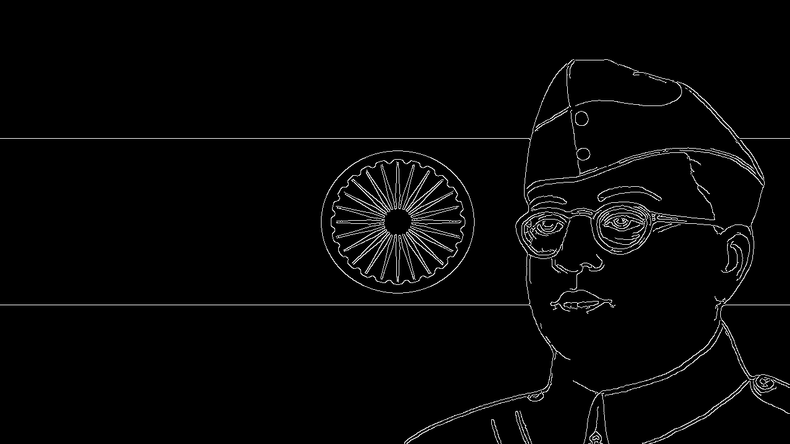
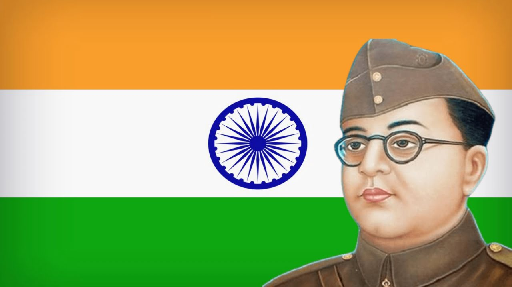

# Make-Sketch
Creates  black/white image with edges in input image

## Use
```
main.py --image-path <> --output-path <> --blur [any one of GAUSSIAN | MEDIAN | AVERAGE]
```
> Note: if image path is empty , it uses any attached camera to take picture automatically

## Example
#### Output image 


#### Input image
